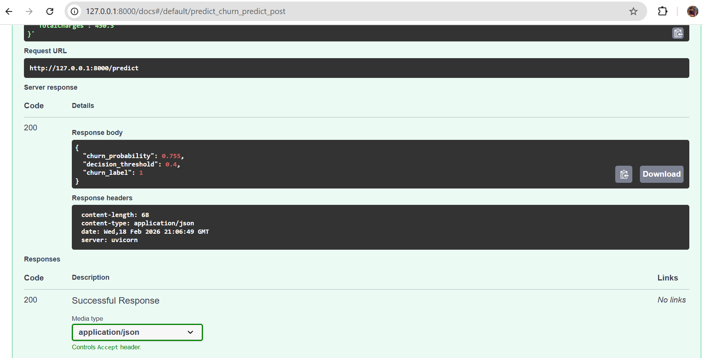
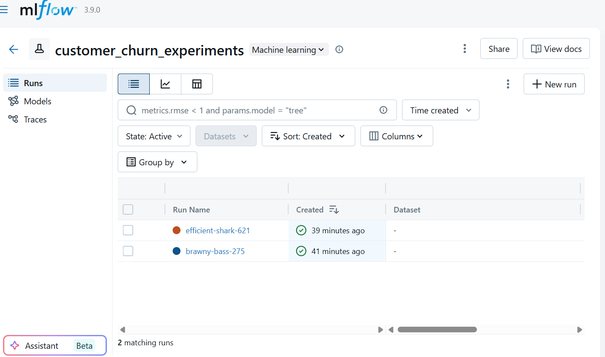
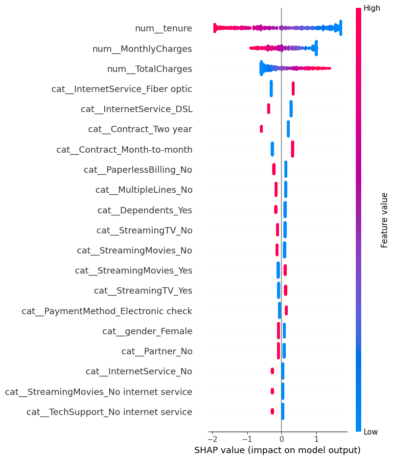
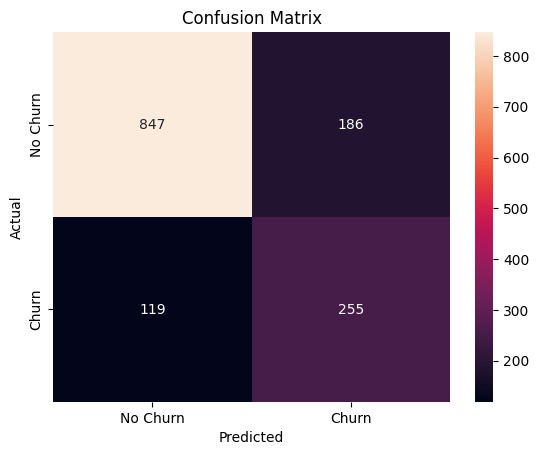

# Customer Churn Prediction System (Production-Grade MLOps)
# 顧客チャーン予測システム（プロダクション対応MLOps）

An end-to-end, production-ready machine learning system for predicting customer churn using structured telecom data.

構造化された通信データを用いて顧客の解約（チャーン）を予測する、エンドツーエンドの本番環境対応機械学習システムです。

This project demonstrates a complete ML lifecycle — from data preprocessing to containerized deployment — following MLOps best practices.

本プロジェクトは、データ前処理からコンテナ化されたデプロイメントまで、MLOpsのベストプラクティスに基づいた完全なMLライフサイクルを実装しています。


---
## Live System Preview

<p align="center">
  
</p>

---

## Business Problem
## ビジネス課題

Customer churn significantly impacts subscription-based businesses and recurring revenue models.

サブスクリプション型ビジネスにおいて、顧客の解約は収益に大きな影響を与えます。

Early identification of high-risk customers enables:
- Targeted retention strategies
- Reduced revenue loss
- Improved customer lifetime value (CLV)

解約リスクの高い顧客を早期に特定することで、以下が可能になります：

- 効果的なリテンション施策
- 収益損失の削減
- 顧客生涯価値（CLV）の向上

This system predicts churn probability and applies configurable business thresholds to support practical decision-making.

本システムは解約確率を予測し、ビジネス要件に応じた閾値設定により実用的な意思決定を支援します。

---

## Key Features  
## 主な特徴

- End-to-end ML pipeline (training → evaluation → deployment)  
  学習から評価、デプロイまでを含むエンドツーエンドのMLパイプライン

- Hyperparameter tuning with Optuna (30 trials)  
  Optunaを用いたハイパーパラメータ最適化（30試行）

- Experiment tracking with MLflow  
  MLflowによる実験管理・モデル管理

- Configurable decision threshold layer  
  ビジネス要件に応じて調整可能な意思決定閾値レイヤー

- Model explainability using SHAP  
  SHAPによるモデルの解釈性・特徴量重要度の可視化

- REST API serving with FastAPI + Swagger UI  
  FastAPIによる推論API構築およびSwagger UIによる自動ドキュメント生成

- Docker containerization  
  Dockerによるコンテナ化（本番環境を想定）

- CI/CD with GitHub Actions  
  GitHub ActionsによるCI/CD自動化

- Unit testing with Pytest (7/7 passing, 68% coverage)  
  Pytestによる単体テスト実装（7/7成功、カバレッジ68%）

- Reproducible and modular project structure  
  再現性および拡張性を考慮したモジュール設計


---
---

## 📂 Dataset
## 📂 データセット

This project uses the IBM Telco Customer Churn Dataset.

本プロジェクトでは、IBM Telco Customer Churn Dataset を使用しています。

- Records: 7,043 customers  
- Features: 20+ structured attributes  
- Target Variable: `Churn` (Yes/No)  
- Churn Rate: ~26.5%

- レコード数：7,043件  
- 特徴量：20以上の構造化データ  
- 目的変数：`Churn`（解約有無）  
- 解約率：約26.5%

### Data Characteristics
### データ特性

- Mixture of categorical and numerical variables  
- Imbalanced binary classification problem  
- Requires preprocessing and encoding  

- カテゴリ変数と数値変数の混在  
- 不均衡な二値分類問題  
- 前処理およびエンコーディングが必要  


## System Architecture

```
Raw CSV Dataset
      ↓
Data Loader
      ↓
Preprocessing (ColumnTransformer)
      ↓
ML Pipeline (XGBoost / Logistic Regression)
      ↓
MLflow Experiment Tracking
      ↓
Probability Output
      ↓
Decision Layer (Configurable Threshold)
      ↓
Explainability (SHAP)
      ↓
FastAPI Inference
      ↓
Docker Container
```

---

## Model Performance

| Model | ROC-AUC | Precision | Recall | F1 |
|-------|---------|-----------|--------|-----|
| XGBoost | 0.847 | 0.59 | 0.663 | 0.624 |
| Logistic | 0.842 | 0.568 | 0.668 | 0.614 |

**Selected model:** XGBoost with decision threshold tuned to `0.4`

| Threshold | Recall | Precision |
|-----------|--------|-----------|
| 0.5 | 54.8% | 63.5% |
| 0.4 ✅ | 66.3% | 59.0% |
| 0.3 | 74.9% | 52.6% |

---

## System Screenshots

### MLflow Experiment Tracking

<p align="center">
  
</p>

<p align="center">
  <em>Experiment comparison and hyperparameter tuning results tracked via MLflow.</em>
</p>

---

### FastAPI Swagger Documentation

<p align="center">
  
</p>

<p align="center">
  <em>Interactive REST API documentation auto-generated by FastAPI.</em>
</p>

---

### SHAP Feature Importance

<p align="center">
  
</p>

<p align="center">
  <em>Global feature importance using SHAP explainability.</em>
</p>

---

### Confusion Matrix

<p align="center">
  
</p>

<p align="center">
  <em>Model performance visualization at decision threshold 0.4.</em>
</p>


---

## Tech Stack

| Category | Tools |
|----------|-------|
| Language | Python 3.10 |
| ML | scikit-learn, XGBoost |
| Tuning | Optuna |
| Explainability | SHAP |
| Tracking | MLflow |
| API | FastAPI |
| Serving | Uvicorn |
| Testing | Pytest |
| CI/CD | GitHub Actions |
| Containerization | Docker |

---

## Project Structure

```
customer-churn/
├── assets/
│   ├── mlflow_ui.png
│   ├── swagger_ui.png
│   ├── shap_plot.png
│   └── confusion_matrix.png
├── src/
│   ├── config.py
│   ├── data_loader.py
│   ├── preprocessing.py
│   ├── modeling.py
│   ├── evaluation.py
│   ├── decision.py
│   ├── explainability.py
│   ├── pipeline.py
│   └── utils.py
├── tests/
│   ├── test_decision.py
│   ├── test_modeling.py
│   ├── test_pipeline.py
│   └── test_preprocessing.py
├── notebooks/
│   ├── 01_eda.ipynb
│   ├── 02_experiments.ipynb
│   ├── 03_model_explainability.ipynb
│   └── 04_evaluation.ipynb
├── models/
├── data/
│   └── raw/
├── app.py
├── Dockerfile
├── pyproject.toml
└── README.md
```

---

## How to Run

### 1. Install Dependencies
```bash
pip install -e .[dev]
```

### 2. Train the Model
```bash
python src/pipeline.py
```

### 3. Launch MLflow UI
```bash
mlflow ui
```
Open: http://127.0.0.1:5000

### 4. Run the API
```bash
uvicorn app:app --reload
```
- API: http://127.0.0.1:8000
- Swagger UI: http://127.0.0.1:8000/docs

### 5. Run with Docker
```bash
docker build -t churn-api .
docker run -p 8000:8000 churn-api
```

### 6. Run Tests
```bash
pytest
pytest --cov=src  # with coverage
```

---

## API Usage

**POST** `/predict`

```json
{
  "gender": "Female",
  "SeniorCitizen": 0,
  "Partner": "Yes",
  "Dependents": "No",
  "tenure": 5,
  "PhoneService": "Yes",
  "MultipleLines": "No",
  "InternetService": "Fiber optic",
  "OnlineSecurity": "No",
  "OnlineBackup": "Yes",
  "DeviceProtection": "No",
  "TechSupport": "No",
  "StreamingTV": "Yes",
  "StreamingMovies": "Yes",
  "Contract": "Month-to-month",
  "PaperlessBilling": "Yes",
  "PaymentMethod": "Electronic check",
  "MonthlyCharges": 89.5,
  "TotalCharges": 450.3
}
```

**Response:**
```json
{
  "churn_probability": 0.755,
  "decision_threshold": 0.4,
  "churn_label": 1
}
```

---

## CI/CD

GitHub Actions automatically runs on every push:
- Unit tests
- Coverage checks

---
---

## 🇯🇵 日本語概要

本プロジェクトは、実務を想定したMLOps構成の機械学習システムです。

- XGBoostおよびロジスティック回帰による分類モデル構築
- Optunaによるハイパーパラメータ最適化
- MLflowによる実験管理
- SHAPによるモデル解釈性の可視化
- FastAPIによるREST API化
- Dockerによるコンテナ化
- GitHub ActionsによるCI/CD

データ分析から本番運用を想定したAPI提供まで、一貫した機械学習パイプラインを実装しています。

## Author

**Hasan Jahid**
